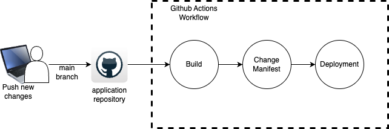

# Infra Spring Petclinic
This repository is dedicated for store infrastructure file for deployment  [application repository](https://github.com/agungardiyanta/spring-petclinic) that forked from [link](https://github.com/spring-projects/spring-petclinic)

*  Web application >> [divewater.xyz](https://divewater.xyz)
*  Grafana >> [grafana.divewater.xyz](https://grafana.divewater.xyz)

---
### Architecture diagram

The diagram show we use Google VM Instance, it use "e2-standard-4" vm type with 4 CPU and 16 GB RAM. The terraform code that use to create vm can see on terraform folder. When create the vm I also put script to install docker and initialize docker swarm.
command to run:
```
terraform init
terraform plan -out main.tfplan
terraform apply main.tfplan
```
### CI/CD diagram

The application use Github Actions for CI/CD deployment,
step of deployment application 
* New changes push to main branch
* It will trigger Github Actions workflow, the workflow or pipeline can see on [workflow.yml](workflow.yml) file or [application repository](https://github.com/agungardiyanta/spring-petclinic/blob/main/.github/workflows/build-image.yml)
* Build
* * checkout the repo
* * login to docker
* * setup Java 17
* * image build with maven
* * push image to dockerhub
* Change Maninfest
* * checkout infra repository
* * update the new image tag for application
* * copy file to vm using scp
* Deployment
* * access vm via SSH
* * run command for deploy
The pipeline need few github actions secret,
dockerhub username and token, git token and email those credential can retrive from docker and github website.
For the ssh key we can create our ssh key and register the public key to VM via gcp console.
command to create the ssh key
```
ssh-keygen -t rsa -b 4096 -C "your_email@example.com"
```
To ensure zero downtime the application deploy on `docker engine` with `swarm mode` 
application and database deploy as service with stack name petclinic. The web service or application setup with 3 replicas and 2 replicas for database

## Observability 

On this project I use grafana, prometheus, loki stack to provide metrics and logging also few service that support it.

I use template from this repository [dolomo](https://github.com/ductnn/domolo)
with few changes that can show in [monitoring.yml](monitoring.yml)

to deploy it I used 
```
docker compose up -d
```

## Expose to Internet
Before expose the app to internet we need to install nginx and certbot the command can show inside this [nginx.sh](nginx.sh)
This application accessible from internet with domain [divewater.xyz](https://divewater.xyz), to see the monitoring dashboard we can access the grafana service via [grafana.divewater.xyz](http://grafana.divewater.xyz)

The app use certbot for ssl certification configuration with wildcard subdomain
the NGINX full config can see inside [conf divewater.xyz](nginx.conf)